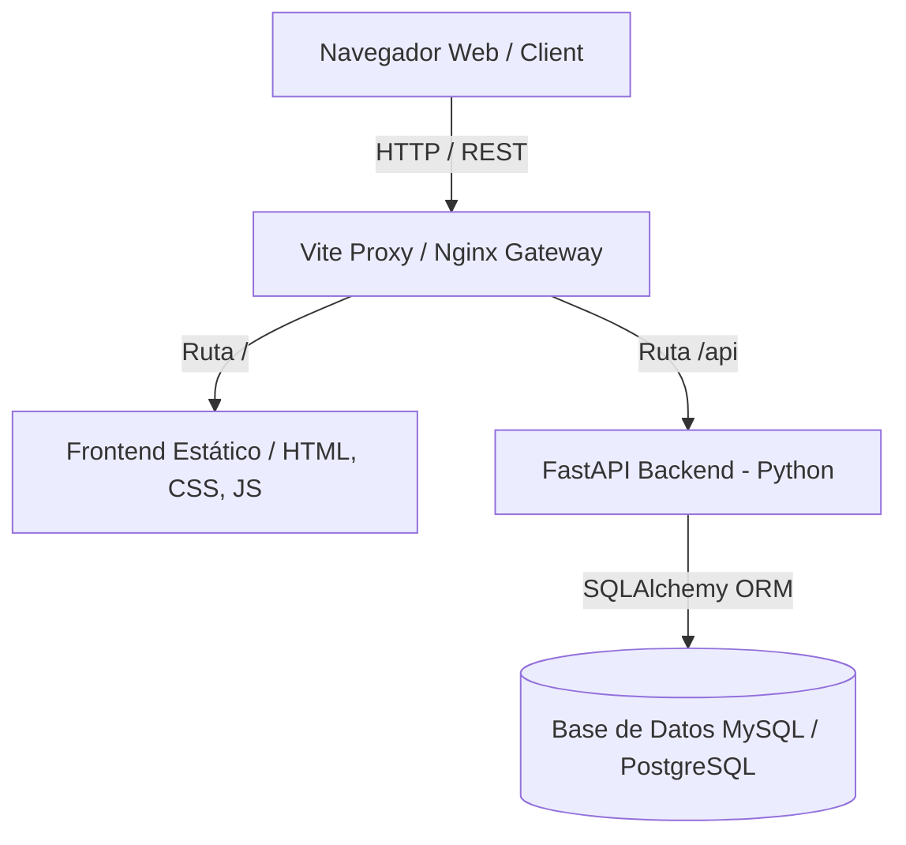

# Auditoría de Actualización de Arquitectura — Plataforma ISO

Este documento detalla los hallazgos de la auditoría y las correcciones de arquitectura implementadas para alinear el sistema con la arquitectura vigente.

---

## 1. Módulo Frontend (Leads y Clientes)

### Desviación Encontrada

Anteriormente, el módulo de Leads existía de forma independiente en `/leads/index.html`. La arquitectura oficial especifica la unificación de Clientes y Leads bajo el módulo `/clientes/`.

### Corrección Ejecutada

1. **Unificación de Interfaz:** Se reescribió `clientes/index.html` para incorporar un sistema de pestañas a nivel superior ("Clientes" y "Leads").
2. **Evitar Colisiones de Identificadores:** Al fusionar las interfaces, se renombraron todos los selectores de formularios utilizando los prefijos `fc-` para Clientes y `fl-` para Leads (evitando el colapso de controles con la función `document.getElementById`).
3. **Mantenimiento de Vistas de Leads:** El panel de Leads conserva la funcionalidad original con sus subpestañas para alternar entre la vista "Kanban" y la vista "Tabla".
4. **Navegación Inteligente:** Se actualizó `assets/js/nav.js` para redirigir el menú de Leads a `/clientes/?tab=leads`. Si se carga la página con ese parámetro, la pestaña de Leads se activa automáticamente.
5. **Configuración de Empaquetado:** Se retiró el punto de entrada de leads en `vite.config.js` y se eliminó por completo el directorio `/leads/`.

---

## 2. Capa Backend (API FastAPI)

### Desviación Encontrada

Existía un enrutador y archivo independiente para la gestión de Leads (`routes/leads.py`).

### Corrección Ejecutada  

1. **Fusión de Rutas:** Se integró la lógica de endpoints CRUD de leads en `backend/routes/clientes.py` bajo un sub-enrutador secundario (`leads_router = APIRouter(prefix="/leads", tags=["Leads"])`).
2. **Actualización de Registros:** Se actualizó `backend/main.py` eliminando el import/router directo de leads y registrando `clientes.leads_router`.
3. **Limpieza de Código:** Se eliminó físicamente el archivo `backend/routes/leads.py`.

---

## 3. Base de Datos y Dockerización

### Desviación Encontrada

La base de datos del sistema local utilizaba PostgreSQL de manera estática, lo cual difería del estándar MySQL indicado por la arquitectura del proyecto. Además, no se disponía de soporte Docker.

### Corrección Ejecutada

1. **Soporte Híbrido Dinámico:** Se actualizó `backend/database.py` para alternar dinámicamente entre dialectos de bases de datos (`mysql+pymysql` o `postgresql+psycopg2`) mediante la variable de entorno `DB_DIALECT`.
2. **Dockerización Completa:**
   - Creación de `docker-compose.yml` que levanta la base de datos MySQL 8, el Backend FastAPI y el Frontend Vite (servido mediante Nginx).
   - Definición de `backend/Dockerfile` y `Dockerfile` (frontend/Nginx).
   - Generación de plantilla de configuración `.env.example` y archivo local `.env`.
   - Inicialización automática del esquema de la base de datos al montar `database/schema.sql` en el directorio de inicialización de MySQL en Docker.

# Arquitectura del Sistema — Plataforma ISO

Este documento presenta la arquitectura del sistema, cubriendo los componentes de Frontend, Backend, Base de Datos y el motor de análisis de red CNA (Customer Network Analysis).

---

## 1. Vista General de la Arquitectura

La plataforma ISO sigue una arquitectura de tres capas:

- **Frontend:** Aplicación web moderna compuesta por páginas HTML estáticas, estilos mediante Vanilla CSS y lógica dinámica en Vanilla JS.
- **Backend:** REST API en FastAPI (Python 3) que valida los esquemas con Pydantic e interactúa con la base de datos a través de SQLAlchemy ORM.
- **Base de Datos:** Motor relacional (MySQL 8 de forma predeterminada mediante Docker, con soporte local opcional para PostgreSQL).

---

## 2. Organización del Frontend

El frontend está estructurado en módulos autocontenidos y recursos compartidos:

- **`/assets/css/estilo.css`:** Sistema de diseño unificado, variables CSS, variables tipográficas (Outfit / Inter) y utilidades de microanimación.
- **`/assets/js/nav.js`:** Sidebar inyectado dinámicamente que detecta la página activa, controlando la navegación unificada.
- **`/assets/js/api.js`:** Cliente HTTP unificado para peticiones REST mediante la API `fetch` nativa del navegador.
- **`/assets/js/utils.js`:** Funciones de formato de fechas, toasts de notificación, control de modales y debounce de búsqueda.
- **Módulos de Negocio:**
  - `/dashboard/`: Cuadro de mandos con KPI globales de la plataforma.
  - `/clientes/`: Gestión unificada de Clientes y Leads (Kanban y tabla).
  - `/propiedades/`: Gestión de inventario de inmuebles.
  - `/asesores/`: Gestión de asesores comerciales.
  - `/cna_clientes/` y `/cna_asesores/`: Vistas del motor de análisis de redes de relaciones.
  - `/kpis/`: Gráficos e indicadores especializados.

---

## 3. Capa de Backend (FastAPI)

El backend sigue el patrón de diseño por capas:

1. **Punto de Entrada (`main.py`):** Configura los middlewares (CORS), expone las rutas de la API bajo el prefijo `/api` y sincroniza las tablas de datos.
2. **Conexión a BD (`database.py`):** Detecta dinámicamente si debe utilizar MySQL o PostgreSQL en función de las variables de entorno, y provee sesiones SQLAlchemy (`get_db`).
3. **Modelos ORM (`models/models.py`):** Define las entidades relacionales de la base de datos.
4. **Validación de Esquemas (`schemas/schemas.py`):** Define las estructuras de datos de entrada/salida mediante Pydantic (Request, Response, Create, Update).
5. **Controladores y Enrutadores (`routes/`):** Implementan los endpoints REST organizados por dominios (clientes, asesores, propiedades, cna, kpis, dashboard).

---

## 4. Motor de Análisis CNA (Teoría de Grafos)

El Customer Network Analysis (CNA) construye dinámicamente un grafo a partir de clientes/asesores (nodos) y sus interconexiones (aristas):

- **Detección Automática de Relaciones:**
  - **Familiares:** Identifica enlaces entre nodos basados en apellidos coincidentes en la base de datos.
  - **Referencias:** Mapea el flujo de prospectos cuando un lead es introducido por recomendación de un cliente existente.
  - **Profesionales:** Asocia nodos basados en campos compartidos como empresas u organizaciones.
  - **Geográficas:** Agrupa clientes por colonias o ciudades.
- **Algoritmos de Centralidad:**
  - Calcula dinámicamente el **Influence Score** y el **Provider Score** para medir la centralidad y el valor económico aportado por cada miembro a la red, categorizándolos en perfiles estratégicos.
