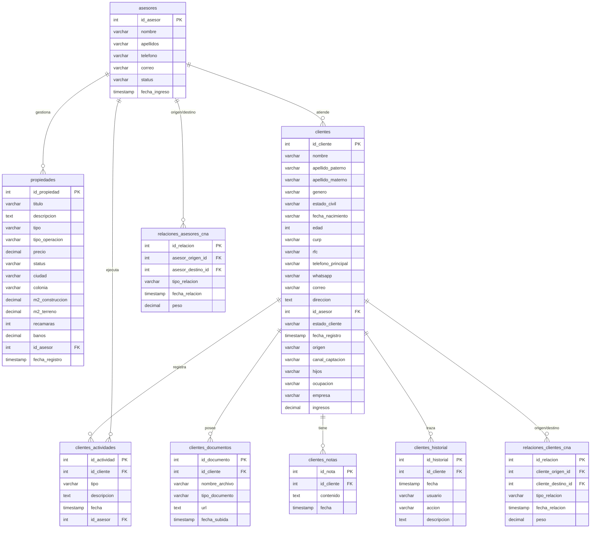

# Modelo de Datos — Plataforma ISO (Expediente Único)

Este documento detalla el esquema relacional de la base de datos de la plataforma ISO, reflejando la nueva arquitectura donde los clientes centralizan su ciclo de vida en un **Expediente Único** (eliminando el modelo paralelo de "Leads").

---

## 1. Diagrama de Relaciones (MER)

---

## 2. Detalle de Tablas

### 2.1. asesores
Almacena los datos de los asesores inmobiliarios vinculados a las propiedades y clientes.
* `id_asesor` (INT, Autoincrementable, PK): Identificador del asesor.
* `nombre` (VARCHAR(100), Obligatorio)
* `apellidos` (VARCHAR(100), Obligatorio)
* `telefono` (VARCHAR(20))
* `correo` (VARCHAR(100))
* `status` (VARCHAR(20), Default: 'activo'): Estado ('activo', 'inactivo').
* `fecha_ingreso` (TIMESTAMP, Default: CURRENT_TIMESTAMP)

### 2.2. clientes (Expediente Base)
Cartera de clientes registrados. La tabla ha sido normalizada para evitar atributos inmobiliarios y centrarse en la persona física o prospecto.
* `id_cliente` (INT, Autoincrementable, PK)
* **Información Básica:** `nombre`, `apellido_paterno`, `apellido_materno`, `genero`, `estado_civil`, `fecha_nacimiento`, `edad`, `curp`, `rfc`.
* **Contacto:** `telefono_principal`, `whatsapp`, `correo`, `direccion`.
* **Información Comercial:** `id_asesor` (FK a Asesores), `estado_cliente` (ej. 'nuevo', 'interesado', 'cotizacion', 'cerrado', 'perdido'), `fecha_registro`, `origen`, `canal_captacion`.
* **Laboral y Familiar:** `hijos`, `ocupacion`, `empresa`, `ingresos`.

### 2.3. Tablas Satélite del Expediente (Actividades, Documentos, Notas, Historial)
Estas tablas implementan la filosofía de "Expediente Único".
* **`clientes_actividades`**: Almacena bitácoras de interacciones. `id_actividad` (PK), `id_cliente` (FK), `tipo` ('llamada', 'reunion', 'correo'), `descripcion`, `id_asesor` (FK).
* **`clientes_documentos`**: Repositorio de archivos asociados. `id_documento` (PK), `id_cliente` (FK), `nombre_archivo`, `tipo_documento`, `url`.
* **`clientes_notas`**: Notas textuales breves. `id_nota` (PK), `id_cliente` (FK), `contenido`.
* **`clientes_historial`**: Trazabilidad automatizada de auditoría. Registra eventos como "creación", "cambio_asesor", "cambio_estado". `id_historial` (PK), `id_cliente` (FK), `accion`, `descripcion`.

### 2.4. propiedades
Inventario de bienes raíces de la inmobiliaria.
* `id_propiedad` (INT, Autoincrementable, PK)
* `titulo` (VARCHAR(200), Obligatorio)
* `descripcion` (TEXT)
* `tipo` (VARCHAR(50), Obligatorio): 'casa', 'departamento', 'terreno', 'local', etc.
* `tipo_operacion` (VARCHAR(20), Obligatorio): 'venta', 'renta'.
* `precio` (DECIMAL(15,2), Obligatorio)
* `status` (VARCHAR(20), Default: 'disponible'): 'disponible', 'reservada', 'vendida', 'rentada'.
* `id_asesor` (INT, FK a `asesores.id_asesor`, ON DELETE SET NULL)

### 2.5. relaciones_clientes_cna
Almacena el grafo de conexiones entre clientes para el análisis de redes (CNA).
* `id_relacion` (INT, Autoincrementable, PK)
* `cliente_origen_id` (INT, FK a `clientes.id_cliente`, ON DELETE CASCADE)
* `cliente_destino_id` (INT, FK a `clientes.id_cliente`, ON DELETE CASCADE)
* `tipo_relacion` (VARCHAR(50), Obligatorio): 'FAMILIAR', 'REFERENCIA', 'PROFESIONAL', 'GEOGRAFICA'.
* `peso` (DECIMAL(3,2), Default: 1.00): Valor del peso de la arista.

### 2.6. relaciones_asesores_cna
Almacena el grafo de conexiones de red interna de asesores.
* `id_relacion` (INT, Autoincrementable, PK)
* `asesor_origen_id` (INT, FK a `asesores.id_asesor`, ON DELETE CASCADE)
* `asesor_destino_id` (INT, FK a `asesores.id_asesor`, ON DELETE CASCADE)
* `tipo_relacion` (VARCHAR(50), Obligatorio): 'FAMILIAR', 'REFERENCIA', 'PROFESIONAL', 'GEOGRAFICA'.
