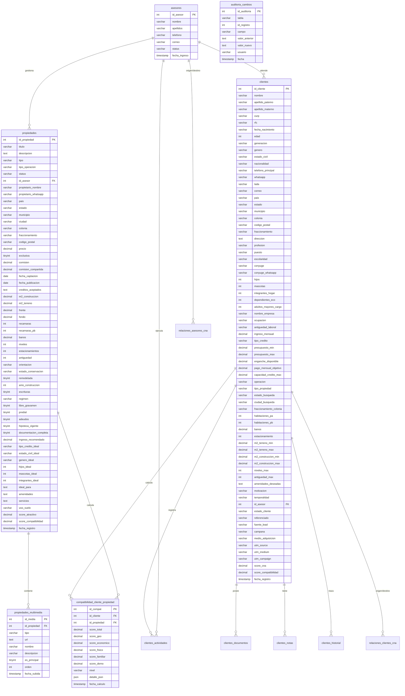

# Modelo de Datos — Plataforma ISO (Expediente Único v2.0)

Este documento detalla el esquema relacional de la base de datos de la plataforma ISO, reflejando la arquitectura donde los clientes centralizan su ciclo de vida en un **Expediente Único** y las propiedades incluyen detalles avanzados de ubicación, físicos, comerciales, legales, perfil ideal y multimedia.

---

## 1. Diagrama de Relaciones (MER)

---

## 2. Detalle de Tablas Nuevas y Modificadas

### 2.1. clientes (Ampliación)
Almacena todos los atributos personales, financieros, familiares y de requerimientos del cliente.
* Mantiene integridad de datos únicos como `curp`, `rfc`, `correo`, `whatsapp` con prevención de duplicados a nivel servicio.
* **Campos Calculados:** `edad`, `generacion` (a partir de la fecha de nacimiento), `lada` (a partir del teléfono/whatsapp).
* **Campos de Requerimiento:** `m2_construccion_min`, `presupuesto_max`, `amenidades_deseadas`, etc.

### 2.2. propiedades (Ampliación)
Almacena la ficha técnica física, legal, comercial y del perfil del comprador ideal.
* **Campos Calculados:** `ingreso_recomendado` (Venta = Precio/120, Renta = Precio/0.30), `score_atractivo` (de acuerdo al porcentaje de llenado físico/legal).

### 2.3. propiedades_multimedia
Permite relacionar múltiples archivos multimedia (fotografías, videos, planos, tours 3D, documentos) a una propiedad.
* `id_media` (INT, PK, Autoincrementable)
* `id_propiedad` (INT, FK a propiedades, ON DELETE CASCADE)
* `tipo` (VARCHAR: 'foto', 'video', 'virtual', 'plano', 'documento')
* `url` (TEXT, URL del CDN/alojamiento externo)

### 2.4. compatibilidad_cliente_propiedad
Almacena el índice de afinidad total y desglosado por las 5 dimensiones entre cada cliente y propiedad disponible.
* `score_total` = (Geo × 25%) + (Eco × 30%) + (Físico × 25%) + (Familiar × 10%) + (Demo × 10%)

### 2.5. auditoria_cambios
Registra cambios históricos a nivel columna de todas las tablas críticas para garantizar trazabilidad.
